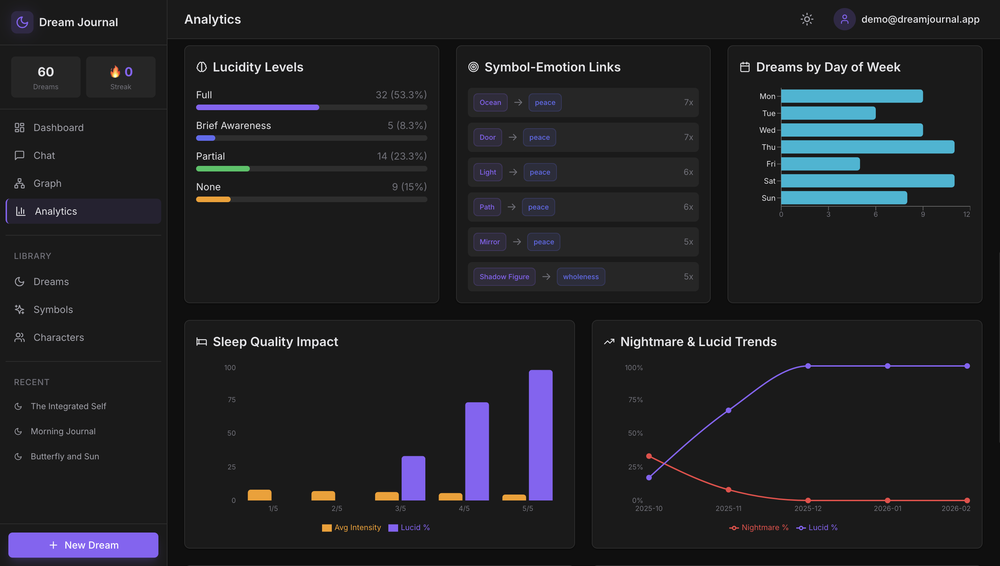
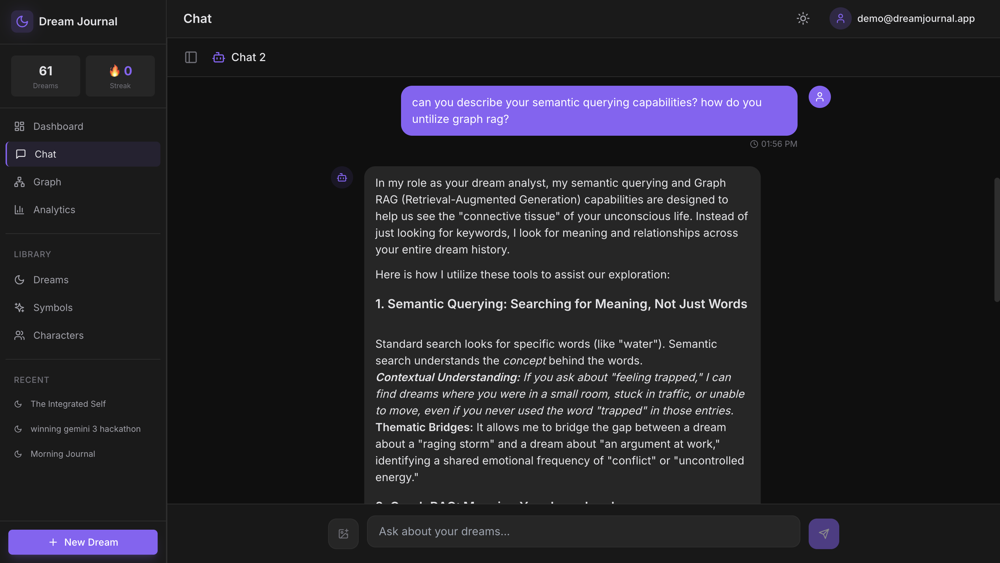
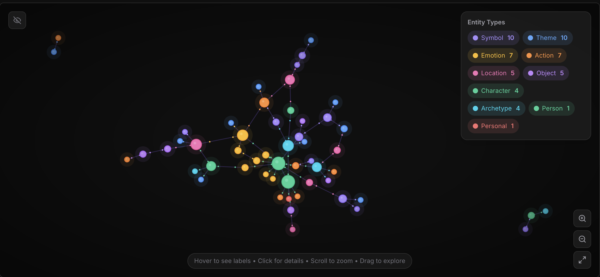
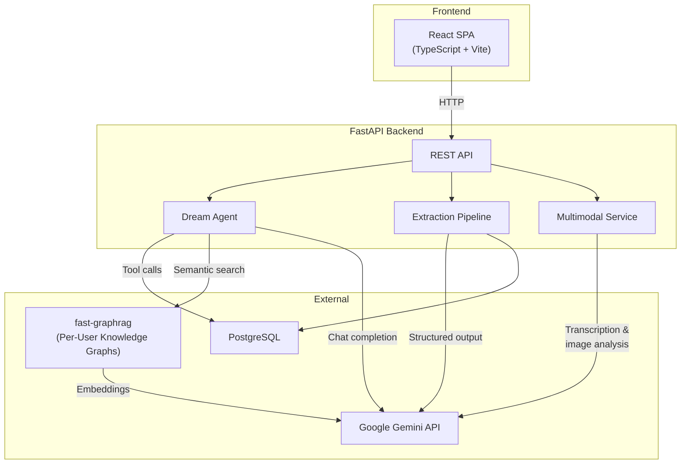
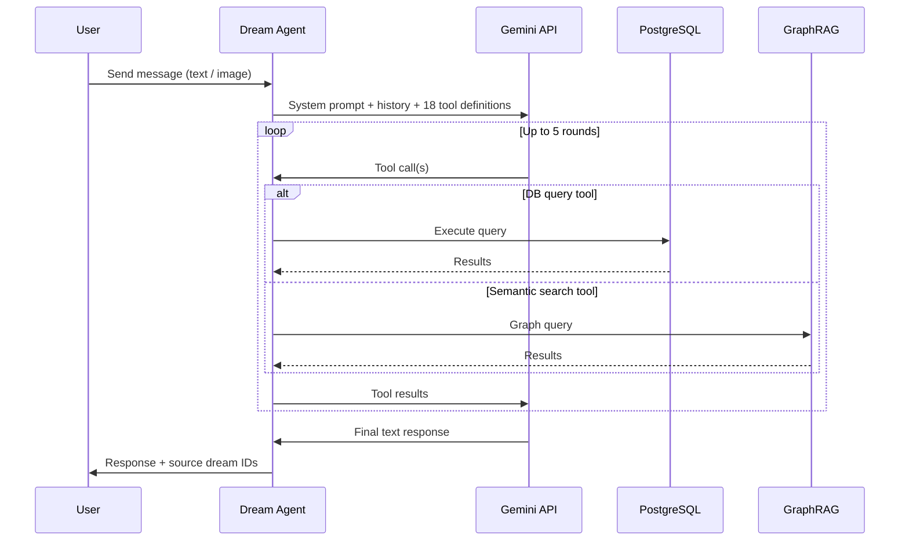
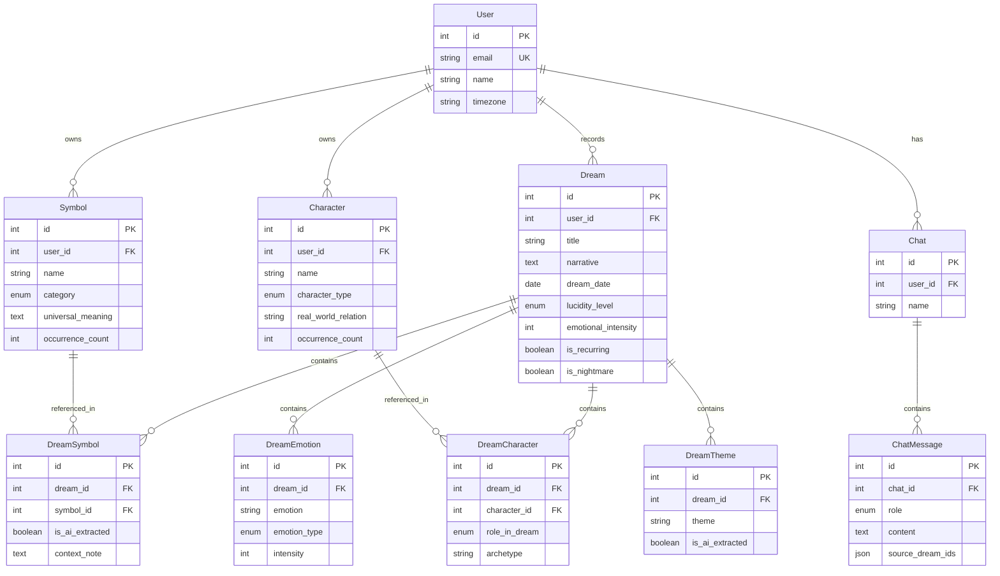

# Dream Knowledge

AI-powered Jungian dream analysis platform with structured extraction, agentic chat, and GraphRAG-based semantic search.





## Key Features

**Dream Journaling**
- Record dreams with structured metadata (emotions, lucidity, sleep quality)
- AI-powered extraction of symbols, characters, themes, and Jungian archetypes
- Multimodal input: text, voice recording (transcription via Gemini), image attachment

**Agentic Chat**
- Conversational dream analysis powered by Gemini (enhanced reasoning) with 18 specialized tools
- Tools query your personal dream database and knowledge graph in real time
- Responses include source citations linking back to specific dreams

**Knowledge Graph**
- Per-user GraphRAG built with fast-graphrag and Gemini embeddings
- Semantic search across all dreams to surface hidden patterns
- Interactive force-directed graph visualization in the browser

**Analytics**
- Emotion tracking over time with intensity trends
- Symbol and character frequency analysis
- Dream pattern insights (recurring dreams, nightmare frequency, lucidity progression)

## Architecture



## Tech Stack

| Layer | Technology |
|-------|-----------|
| Frontend | React 18, TypeScript, Vite, Tailwind CSS, React Query, Recharts |
| Backend | FastAPI, SQLAlchemy (async), Pydantic v2, Alembic |
| Database | PostgreSQL 15 |
| LLM | Google Gemini (gemini-3-flash-preview) via `google.genai` |
| Knowledge Graph | fast-graphrag with Gemini gemini-embedding-001 (768-dim) |
| Auth | JWT (HS256, 7-day expiry) |

## Agent Tool Flow

When a user sends a chat message, the Dream Agent orchestrates a multi-turn tool-use loop with Gemini:



## Data Model



## Getting Started

### Prerequisites

- Docker and Docker Compose
- Python 3.11+
- Node.js 18+
- A [Google Gemini API key](https://aistudio.google.com/apikey)

### Setup

1. **Clone the repository**

```bash
git clone https://github.com/remidiosu/dreams.git
cd dream_knowledge
```

2. **Configure environment**

```bash
cp backend/.env.example backend/.env
```

Edit `backend/.env` and fill in:
- `GEMINI_API_KEY` — your Gemini API key
- `SECRET_KEY` — any random string for JWT signing

3. **Start PostgreSQL**

```bash
cd backend
docker-compose up -d postgres
```

4. **Run database migrations**

```bash
cd backend
pip install -r requirements.txt
alembic upgrade head
```

5. **Seed demo data** (optional)

```bash
psql -h localhost -U test -d db -f seed_demo.sql
```

Demo user credentials: `demo@dreamjournal.app` / `demo`
Or auto login with `?demo=true` in the URL. 

6. **Start the backend**

```bash
python main.py
```

Backend will be available at `http://localhost:8000`. API docs at `http://localhost:8000/docs`.

7. **Start the frontend**

```bash
cd frontend
npm install
npm run dev
```

Frontend will be available at `http://localhost:3000`.

### Full-Stack Docker (alternative)

Run everything with a single command:

```bash
cd backend
docker-compose up --build
```

This starts PostgreSQL, the backend (with auto-migration), and the frontend. Access the app at `http://localhost:3000`.

## Demo Mode

Append `?demo=true` to the URL to auto-login as the demo user without needing credentials:

```
http://localhost:3000/?demo=true
```

## API Endpoints

| Router | Prefix | Auth Required |
|--------|--------|:---:|
| Auth | `/auth` | No |
| Dreams | `/dreams` | Yes |
| Symbols | `/symbols` | Yes |
| Characters | `/characters` | Yes |
| Chat | `/chat` | Yes |
| Graph | `/graph` | Yes |
| Analytics | `/analytics` | Yes |
| Extraction | `/extract` | Yes |
| Demo | `/demo` | No |

Full API documentation is auto-generated at `/docs` (Swagger UI).

## Project Structure

```
dream_knowledge/
├── backend/
│   ├── app/
│   │   ├── controllers/      # FastAPI route handlers
│   │   ├── services/         # Business logic (agent, extraction, indexing)
│   │   ├── repositories/     # Database queries
│   │   ├── models/           # SQLAlchemy ORM models
│   │   ├── data_models/      # Pydantic request/response models
│   │   ├── schemas/          # Internal data structures
│   │   ├── llm/tools/        # 18 agent tool definitions
│   │   ├── prompts/          # System prompts (agent, extraction, domain)
│   │   ├── dependencies/     # FastAPI dependencies (auth)
│   │   └── config.py         # Settings (from .env)
│   ├── alembic/              # Database migrations
│   ├── data/graphs/          # Per-user GraphRAG storage
│   ├── main.py               # FastAPI app entrypoint
│   ├── Dockerfile
│   ├── docker-compose.yml
│   └── railway.toml
├── frontend/
│   ├── src/
│   │   ├── pages/            # Route pages (Dashboard, Dreams, Chat, Graph, etc.)
│   │   ├── components/
│   │   │   ├── ui/           # Reusable UI components
│   │   │   └── layout/       # Sidebar, Header, Layout
│   │   ├── hooks/            # Custom hooks (useApi, useAudioRecorder, useTheme)
│   │   ├── lib/              # API client, auth context, utilities
│   │   └── styles/           # Global CSS + Tailwind
│   ├── Dockerfile
│   ├── nginx.conf
│   └── railway.toml
└── README.md
```

## License

MIT
